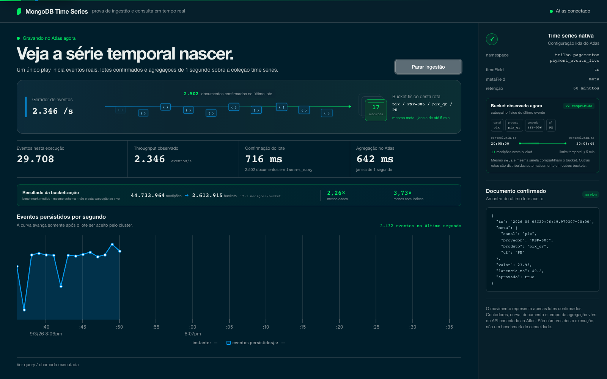
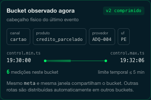
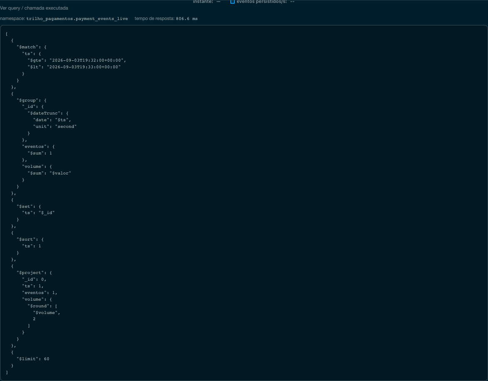

# Payment rail telemetry on MongoDB Atlas time series

A visual, measurable proof that MongoDB Atlas can receive payment events in a native
time series collection and aggregate the series while it is still being written.

The stage deliberately has **one screen, one Play button and one claim**. PIX, card and
TED are dimensions of the same payment rail, not three ingestion pipelines. The UI only
shows values returned after Atlas acknowledges the write.



> All data is synthetic and all providers are fictional. No customer traffic, identity,
> cluster hostname or connection string is included in this repository.

## The demonstration

### 1 · Start one live payment feed

Press **Iniciar ingestão**. One background process generates mixed PIX, card and TED
events and sends one `insert_many` batch per second to `payment_events_live`.

The moving BSON documents represent only writes already acknowledged by Atlas. The
screen then reports:

- events confirmed in the current run;
- observed events per second, rather than the configured generator target;
- batch acknowledgement latency;
- concurrent aggregation latency;
- a throughput curve built from complete one-second windows.

The stage operating point was measured on the shared M20 at **2,281 confirmed events/s**
for a full 60-second window, with the aggregation running concurrently.

Immediately below the live metrics, a compact evidence strip connects the physical
mechanism to its measured result on the same schema. It is explicitly labelled as a
historical benchmark—not as output from the short live run:

```text
44.7 M measurements → 2.61 M buckets · 17.1 measurements/bucket
2.26× less data/event · 3.73× less total storage/event including indexes
```

### 2 · Watch MongoDB place measurements into buckets

The ingestion lane ends in a stack of route buckets instead of a generic database icon.
The highlighted bucket is the physical bucket containing the latest document shown on
the right-hand side.



The bucket evidence is read from `system.buckets.payment_events_live` and exposes only
its header:

- `meta`: the identity of the series;
- `control.min.ts` and `control.max.ts`: the time range currently stored;
- `control.count`: measurements in the bucket;
- `control.version`: the physical bucket format — version 2 is compressed here.

In this model, the `metaField` is the payment route:

```json
{
  "canal": "cartao",
  "provedor": "ADQ-004",
  "produto": "credito_parcelado",
  "uf": "PE"
}
```

Measurements with the same complete `meta` value and compatible timestamps can share a
bucket. Other routes are distributed into other buckets automatically. `provedor` is the
fictional institution processing the event: `PSP-*` for PIX, `ADQ-*` for card acquirers
and `BCO-*` for TED participants.

The collection uses a five-minute maximum bucket span for the live visualisation and a
one-hour TTL. Retention is therefore the database's responsibility: old buckets expire
without an application cleanup job.

### 3 · Inspect the aggregation that draws the chart

Open **Ver query / chamada executada**. The drawer shows the exact namespace, response
time and aggregation pipeline used by the visible chart — not a pre-recorded example.



The pipeline filters the current 60-second session, groups measurements with
`$dateTrunc`, sums events and value, sorts the completed seconds and returns at most 60
points. The current second is excluded because it is still being written; including it
would create a false throughput drop at the end of the line.

## Architecture

```text
synthetic payment rail
PIX + card + TED
        │
        ▼
one mixed insert_many batch / second
        │ majority acknowledgement
        ▼
payment_events_live
native time series + 1 h TTL
        │
        ├── physical buckets by meta + time window
        │
        └── concurrent 1-second aggregation
                    │
                    ▼
              live 60-second chart
```

Every Play starts a new logical session using `started_at`; it does not drop previous
events. The query uses the later of the session start or the beginning of the rolling
60-second window. TTL remains the only retention mechanism.

## Why a time series collection instead of a normal collection?

A normal MongoDB collection can store timestamps, use TTL indexes and run aggregations.
The difference is that a native time series collection gives MongoDB explicit measurement
semantics and an internal bucket representation.

| Concern | Normal collection | Native time series collection |
|---|---|---|
| Physical layout | one BSON document per event | measurements packed into internal buckets |
| Series identity | application convention and ordinary indexes | explicit `metaField` used to organise series |
| Time | ordinary date field | required `timeField` with bucket min/max bounds |
| Compression | general storage-engine compression | column-oriented compression inside buckets |
| Retention | document TTL index | collection `expireAfterSeconds`, enforced on buckets |
| Best fit | general operational documents | append-oriented measurements queried by time and series |

This is a trade-off, not a universal win. In the controlled 400,000-event experiment,
the plain collection ingested faster. The time series model earned its place through
storage density, time-oriented access and automatic lifecycle management.

Measured on the full 44.7 M event dataset, the time series representation used
**2.26× less data storage per event** and **3.73× less total storage when indexes were
included**. The exact experiments are in [`queries/benchmarks.md`](queries/benchmarks.md)
and the modelling decisions are documented in
[`ADR 0001`](docs/adr/0001-bucketing.md) and
[`ADR 0002`](docs/adr/0002-cardinalidade.md).

## Data model

```javascript
{
  ts: ISODate("2026-09-03T19:32:06.142Z"),
  meta: {
    canal: "cartao",
    provedor: "ADQ-004",
    produto: "credito_parcelado",
    uf: "PE"
  },
  valor: 83.04,
  latencia_ms: 403.1,
  aprovado: true,
  erro: null,
  conta_id: "C000541175"
}
```

`conta_id` intentionally remains a measurement field with a secondary index. Putting
millions of accounts inside the `metaField` would create millions of sparse series. In
the measured cardinality experiment, that alternative created 399,924 buckets for
400,000 events, increased index storage by 27× and reduced ingestion throughput by 7×.

## Measured results

All figures below were measured against the same shared Atlas M20 used by the demo. They
are evidence for this environment, not a production sizing recommendation.

### Live stage capacity

| Workload | Confirmed rate | Batch p95 | Concurrent aggregation p95 | Result |
|---|---:|---:|---:|---|
| stage default, 60 s | **2,281/s** | **820.8 ms** | **768.2 ms** | 140,718 writes, no errors |
| upper hold, 60 s | 3,026/s | 1,000.0 ms | 1,129.6 ms | no errors, insufficient stage headroom |
| ramp knee, 12 s | 4,430/s | 1,210.0 ms | 617.2 ms | write cycle exceeds the one-second pulse |

The default is deliberately below the observed knee. A smooth, sustained proof with
concurrent queries is more credible than displaying the largest short-lived number.

### Dataset and modelling evidence

| Measurement | Result |
|---|---:|
| historical events | 44,733,964 |
| fictional providers | 44 |
| route combinations | ~2,900 |
| synthetic accounts | 2,000,000 |
| time series data reduction vs plain collection | 2.26× |
| total reduction including indexes | 3.73× |
| series-contiguous ingest in bucket experiment | 12,308/s |
| account as field vs account in `meta` | 27× smaller index |

## What this proves

- Atlas acknowledges a mixed payment workload into a native time series collection.
- PIX, card and TED can share one ingestion process because channel is event data.
- Writes and a one-second aggregation can run concurrently.
- The UI can trace the latest confirmed document to its physical route bucket.
- `timeField`, `metaField`, TTL, bucket header and pipeline come from the connected
  cluster rather than hard-coded success states.

## What this does not prove

- the peak capacity required by a real bank;
- production sizing or the effect of sharding;
- superiority over InfluxDB, TimescaleDB, ClickHouse or Prometheus;
- a Kafka, back-pressure or multi-region ingestion architecture;
- customer-specific latency, cardinality or retention requirements.

Read [`LIMITATIONS.md`](LIMITATIONS.md) before presenting the PoV. It separates the stage
claim from conclusions that require the customer's workload and SLOs.

## Repository map

| Path | Purpose |
|---|---|
| [`backend/`](backend/) | FastAPI routes, Atlas queries and live feed |
| [`frontend/`](frontend/) | React/LeafyGreen stage interface |
| [`data-generator/`](data-generator/) | synthetic providers, accounts and payment events |
| [`schema/`](schema/) | collection and index definitions |
| [`queries/`](queries/) | reproducible benchmarks and query measurements |
| [`docs/adr/`](docs/adr/) | measured modelling decisions |
| [`docs/demo-script.md`](docs/demo-script.md) | customer presentation sequence |
| [`tests/`](tests/) | hostile API tests and capacity ramp |

## Prerequisites

- a MongoDB Atlas cluster — tested on M20, not asserted as a minimum tier;
- Python 3 with `venv`;
- Node.js and npm;
- network access from the presenting host to Atlas.

## Setup

```bash
git clone https://github.com/adrianofratelli-glitch/atlas-timeseries-pagamentos.git
cd atlas-timeseries-pagamentos

cp .env.example .env
# Set MONGODB_URI in .env. Never commit the real connection string.

python3 -m venv .venv
.venv/bin/pip install -r data-generator/requirements.txt

python3 -m venv backend/venv
backend/venv/bin/pip install -r backend/requirements.txt

(cd frontend && npm install)
```

Generate the synthetic historical dataset and start the application:

```bash
bash data-generator/run_all.sh
./start.sh
```

- API: `http://127.0.0.1:8400`
- UI: `http://127.0.0.1:5400`

For a smaller local dataset:

```bash
DAYS=2 EVENTS_PER_SECOND=40 bash data-generator/run_all.sh
```

## Verification

```bash
python3 -m compileall -q backend tests
(cd frontend && npm run build)

.venv/bin/python tests/test_resilience.py
.venv/bin/python tests/stress.py
.venv/bin/python queries/bench.py --runs 20
```

With the application already running, reproduce the bounded live-capacity ramp:

```bash
python3 tests/live_ingest_capacity.py --duration 12
```

The ramp writes synthetic events to `payment_events_live` and stops automatically when
the configured latency boundary is crossed. It never clears the collection; the TTL
expires its data.

Measured results are tracked in [`queries/benchmarks.md`](queries/benchmarks.md) and are
re-measured instead of copied forward when the cluster or workload changes.

The previous electricity-metering version remains available in the `v1-energia` tag.
