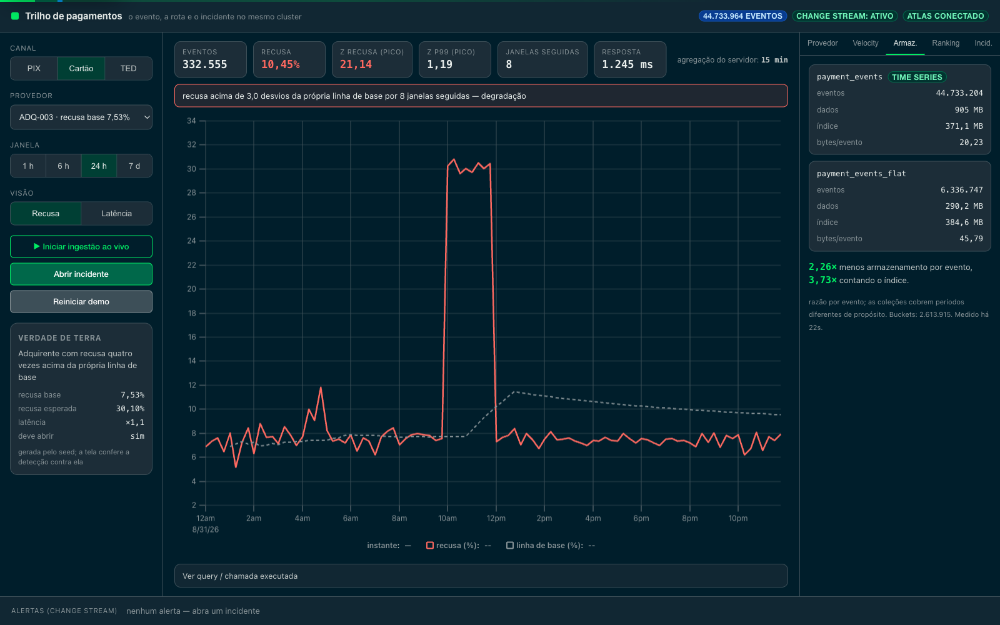
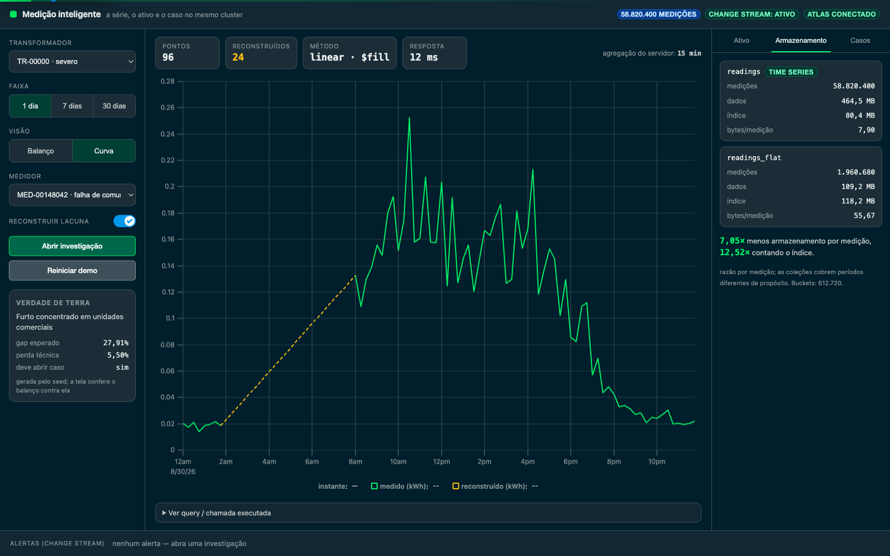
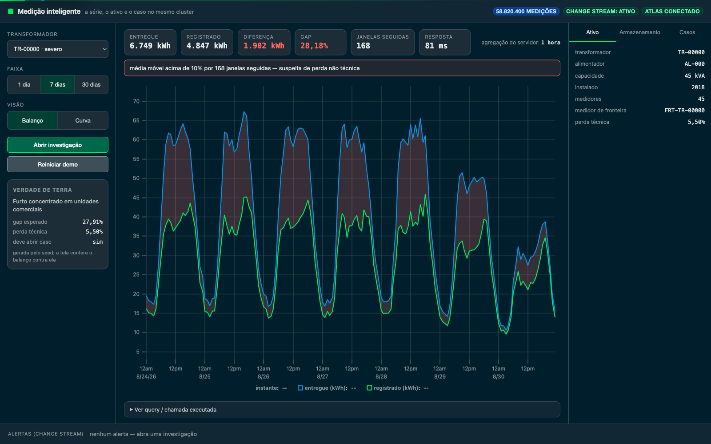
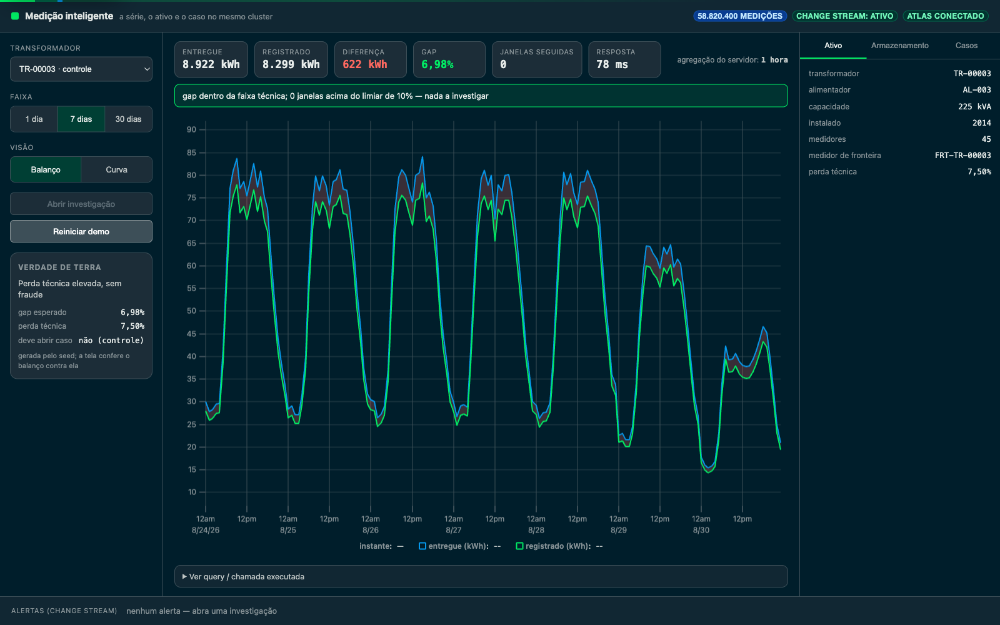
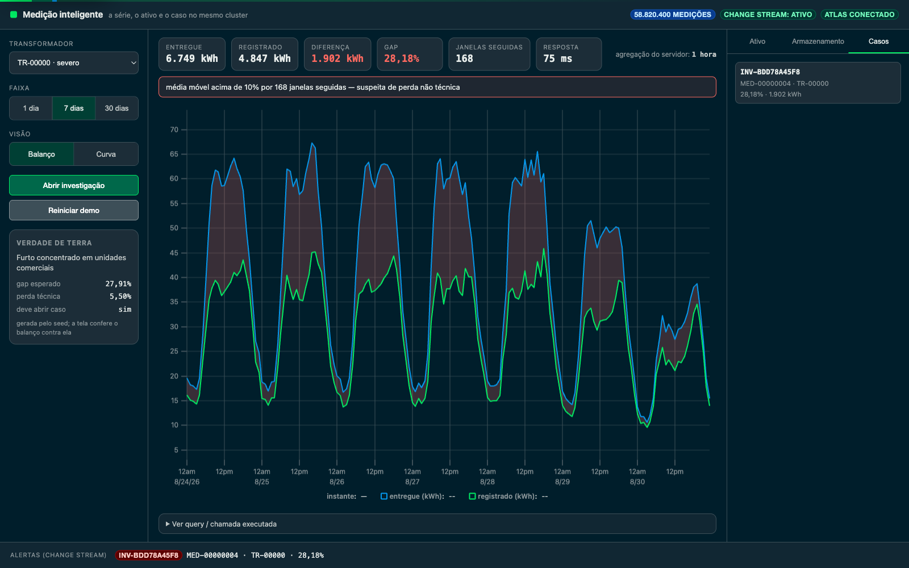
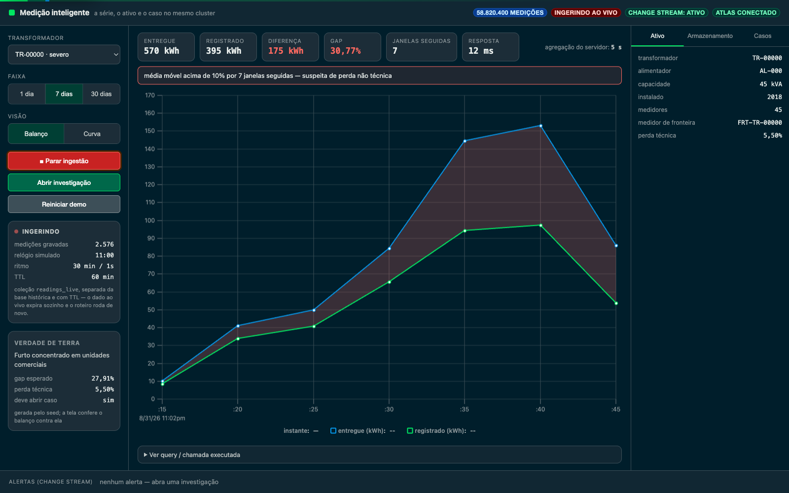

# Smart metering on MongoDB Atlas time series

A utility reads twenty thousand meters every fifteen minutes and wants to know which
transformers are losing energy it never billed. The usual answer to that is four
systems: a time series database for the readings, a relational database for the
meters and customers, a cache for the dashboard, and a search engine for the
investigation history. Four systems, four drivers, four ways to be paged at 3 a.m.,
and one report that has to join across all of them.

This demonstration puts the whole thing in one Atlas cluster and measures what that
costs.

> Synthetic data, fictional distributor. No customer identity, no real feeder codes.

## The demonstration

**1 · Storage, measured here**
The same readings written twice — a plain collection and a time series collection —
with `$collStats` side by side and the ratio computed on screen. Not a number from a
datasheet: **7.05× less storage per measurement, 12.52× counting the index**, on
58 820 400 measurements.



**2 · The load curve**
One meter, thirty days, tens of millions of measurements in the collection.
`$dateTrunc` at the granularity the server picks from the requested range, with the
response time next to the chart.

**3 · The gap**
A meter that stopped communicating for six hours. `$densify` creates the missing
timestamps and `$fill` reconstructs the values — inside the pipeline, in 12 ms, with
every reconstructed point labelled and drawn dashed.



**4 · Non-technical loss**
The transformer's boundary meter against the sum of the meters below it.
`$setWindowFields` gives the moving average; a sustained gap becomes a suspicion. The
measured gap is 28.18% against the 27.91% the seed planted — the demo is checked
against a known answer, not against luck.



A transformer whose gap is ordinary technical loss raises nothing. The negative control
matters more than the positive one: a detector that flags everything is not a detector.



**5 · The case**
Opening an investigation marks the meter, writes the case and emits the event in one
ACID transaction. A change stream turns it into an alert on screen with nobody
reloading anything.



**6 · Live ingestion**
Press play and the series grows on screen. A background feed writes real measurements
into `readings_live` — a separate time series collection with a one-hour TTL — while
the balance repaints every 1.5 s and the gap opens in front of the room. The TTL is the
point: the data expires on its own, so the script runs again an hour later with nothing
to clean up.



**7 · The lifecycle**
`expireAfterSeconds` on the hot collection, Online Archive for the cold years, one
query reading across both.

## Why this shape of workload, and not another

| | This PoV | A dedicated time series engine |
|---|---|---|
| Write rate | thousands/s, steady | millions/s, bursty |
| The question | joins the series to the asset, the customer and the case | stays inside the series |
| Cardinality | tens of thousands of sources | millions of sources |
| What hurts today | operating and joining four systems | raw ingestion throughput |
| Honest answer | consolidate | keep the specialised engine |

A distribution utility's metering workload sits firmly in the left column. A
telemetry platform ingesting from millions of devices does not, and this repository
says so rather than pretending otherwise.

## Limits

`LIMITATIONS.md` is required reading before presenting. Short version: this does not
prove ingestion at millions of points per second, does not shard the time series
collection, and is not a benchmark against InfluxDB or TimescaleDB. Raise those before
the customer's architect does.

## Setup

```bash
cp .env.example .env        # MONGODB_URI
python3 -m venv .venv && .venv/bin/pip install -r data-generator/requirements.txt
python3 -m venv backend/venv && backend/venv/bin/pip install -r backend/requirements.txt
(cd frontend && npm install)

bash data-generator/run_all.sh
./start.sh                  # API on 8400, interface on 5400
```

## Tests

```bash
.venv/bin/python tests/test_resilience.py
.venv/bin/python tests/stress.py
.venv/bin/python queries/bench.py --runs 30
```

Measured numbers live in `queries/benchmarks.md`, and they are re-measured rather than
copied forward when the cluster or the volume changes.

## Status

Built and running against a real Atlas cluster (M20, MongoDB 9.0). **58 820 400
measurements**, 19 980 meters plus 444 boundary meters, 30 days at one reading per 15
minutes — 464 MB of data and 80 MB of index.

Measured: 35 hostile cases passing, mixed-workload stress with no 5xx up to 64
concurrent clients, a 30-day load curve in 16.3 ms over an 8.5 ms network floor, and
the transformer balance matching the seeded ground truth to within 0.3 percentage
points. The numbers are in [`queries/benchmarks.md`](queries/benchmarks.md); the build
order and the decisions are in [`implementation_plan.md`](implementation_plan.md).

The screenshots above were captured at 1600×1000 against that cluster with each
scenario executed first. The utility is fictional and the data fully synthetic, so no
customer identity appears in them.
