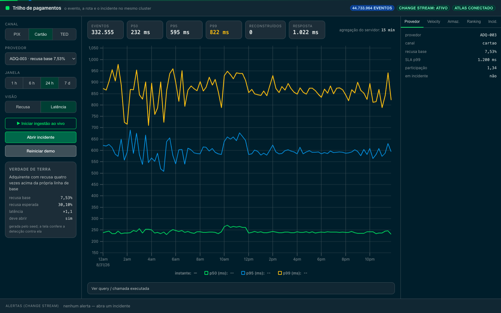
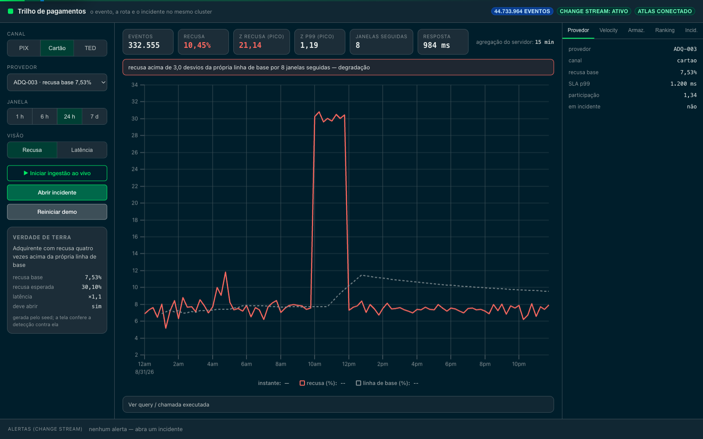
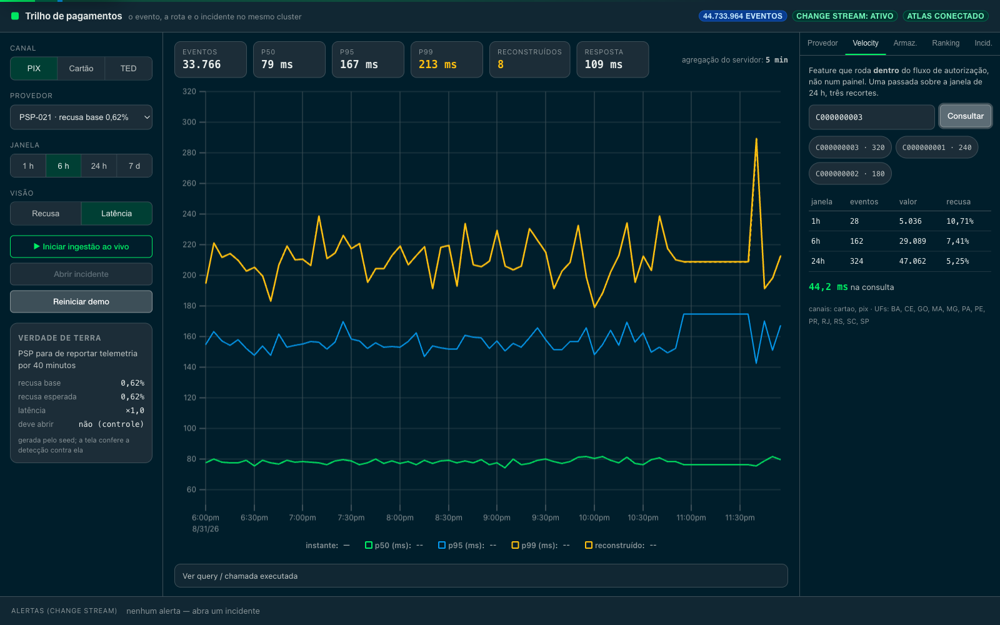

# Payment rail telemetry on MongoDB Atlas time series

A digital bank runs a payment rail. Every second it needs to know whether an acquirer
started declining more than it should, what the p99 authorisation latency is per PSP,
and — inside the authorisation itself, in tens of milliseconds — how many transactions
this account has attempted in the last hour.

The usual architecture for that is five systems: a time series database for the metrics,
a relational database for the provider registry, a cache for the dashboard, a search
engine for the incident history, and a feature store for the antifraud velocity. Five
sets of credentials, five backups, five on-call rotations, and one question that has to
be joined across all of them.

This demonstration puts the whole thing in one Atlas cluster and measures what that
costs.

> Synthetic data, fictional providers. No customer traffic, no customer decline rates.

## The demonstration

**1 · Storage, measured here**
The same events written twice — a plain collection and a time series collection — with
`$collStats` side by side and the ratio computed on screen: **2.26× less storage per
event, 3.73× counting the index**, over 44.7 M events. Not a number from a datasheet.


**2 · Latency by percentile, not by average**
`$percentile` over raw events gives p50, p95 and p99 per window, per provider, in the
pipeline. A rail is judged by its tail; an average hides the customer who waited four
seconds.



**3 · The telemetry gap**
A PSP stops reporting for forty minutes. `$densify` creates the missing windows and
`$fill` carries the last observation forward — inside the pipeline, in 40 ms, with every
reconstructed point labelled and drawn dashed.


**4 · Degradation, against the provider's own baseline**
`$setWindowFields` computes each provider's trailing mean and standard deviation
*excluding the window being judged*, and the z-score says how far the current window
drifted. A sustained deviation is an incident.



The negative control is the point: a credit acquirer that declines **23.50% of
everything, all day, by product mix** must not raise anything, while the degraded one —
whose *average* over the day is only 10.45% — must. An absolute threshold flags the
healthy provider and misses the broken one. This detector gets both right, and the
ground-truth panel on screen says what the seed planted.


**5 · Velocity inside the authorisation**
Events, amount and decline rate for one account over 1 h, 6 h and 24 h — one pass, one
round trip, **28.9 ms p50** over 44.7 M events, against a 17.2 ms network floor.

 Same collection, same cluster. The
account is a **measurement field with a secondary index**, not a meta field: that is the
answer to "won't millions of accounts explode this?", and
[`docs/adr/0002-cardinalidade.md`](docs/adr/0002-cardinalidade.md) has the measurement
rather than the opinion.

**6 · Live, with a degradation you cause**
Press play and events start landing in a separate collection with a one-hour TTL. Press
*Injetar degradação* and watch the decline rate lift off the provider's registered
baseline, the verdict flip, the incident open in one ACID transaction and the alert
arrive through a change stream — nothing pre-recorded, and nothing to clean up
afterwards.


## Why this shape of workload, and not another

| | This PoV | A dedicated time series engine |
|---|---|---|
| Write rate | thousands/s, steady | millions/s, bursty |
| The question | joins the event to the provider, the account and the incident | stays inside the series |
| Route cardinality | thousands | millions |
| What hurts today | operating and joining five systems | raw ingestion throughput |
| Honest answer | consolidate | keep the specialised engine |

A bank's rail telemetry sits in the left column. A device-telemetry platform ingesting
from millions of endpoints does not, and this repository says so rather than pretending
otherwise.

## Limits

`LIMITATIONS.md` is required reading before presenting. Short version: this does not
prove ingestion at a bank's real peak, does not shard the collection, is not a benchmark
against InfluxDB or Prometheus, and runs at two million accounts rather than tens of
millions. Raise those before the customer's architect does.

## Setup

```bash
cp .env.example .env        # MONGODB_URI
python3 -m venv .venv && .venv/bin/pip install -r data-generator/requirements.txt
python3 -m venv backend/venv && backend/venv/bin/pip install -r backend/requirements.txt
(cd frontend && npm install)

bash data-generator/run_all.sh
./start.sh                  # API on 8400, interface on 5400
```

## Tests

```bash
.venv/bin/python tests/test_resilience.py
.venv/bin/python tests/stress.py
.venv/bin/python queries/bench.py --runs 20
.venv/bin/python queries/bucket_experiment.py         # ADR 0001
.venv/bin/python queries/cardinality_experiment.py    # ADR 0002
# com a UI já no ar: reload, teclado e 320/768/1600 px
node ../pov-portfolio/tests/browser_surface_smoke.mjs timeseries=http://127.0.0.1:5400
```

Measured numbers live in [`queries/benchmarks.md`](queries/benchmarks.md), and they are
re-measured rather than copied forward when the cluster or the volume changes.

## Status

Built and executed against a real Atlas M20 cluster: **44 733 964 events**, 7 days, 44
providers, 2 000 000 accounts — 905 MB of data and 371 MB of index.

Measured: 52 hostile cases passing, mixed-workload stress with no 500 and no dead
connection up to 32 concurrent clients, account velocity at 28.9 ms p50 over a 17.2 ms
network floor, and all four planted scenarios — including the negative control —
detected exactly as the ground truth says they should be.

The screenshots above were captured against that cluster with each scenario executed
first. The providers are fictional and the data fully synthetic, so no customer identity
appears in them.

The previous version of this PoV (smart electricity metering) is preserved in the
`v1-energia` tag.

